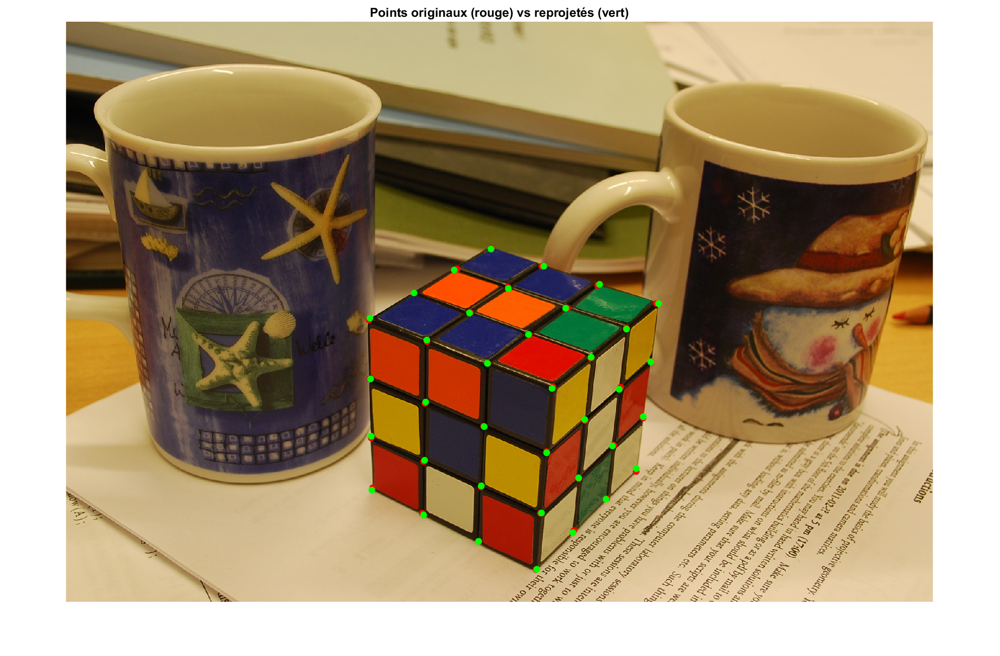

# 6DOF Pose Estimation using DLT in MATLAB

This repository contains MATLAB code for estimating the 6 Degrees of Freedom (6DOF) pose of an object using the **Direct Linear Transform (DLT)** algorithm. The project includes:
- 3D-to-2D point correspondences.
- Reprojection of 3D points onto a 2D image.
- Calculation of the camera's intrinsic and extrinsic parameters (K, R, t).

## Table of Contents
- [Introduction](#introduction)
- [Requirements](#requirements)
- [Usage](#usage)
- [Methodology](#methodology)
- [Results](#results)
- [License](#license)

## Introduction
The goal of this project is to estimate the pose (position and orientation) of a 3D object relative to a camera using 2D image points and their corresponding 3D world points. The DLT algorithm is used to compute the projection matrix, which is then decomposed into intrinsic and extrinsic camera parameters.

## Requirements
- MATLAB (tested on R2021a or later).
- Image Processing Toolbox (for image visualization).
- Data files: `3D2Dpoints.mat` and `cubeRGB.JPG`.

## Usage
1. Clone the repository:
   ```bash
   git clone https://github.com/Malek-Dinari/6DOF-Pose-Estimation-DLT.git
   ```

2.  Open MATLAB and navigate to the repository folder.

3.  Run the `main.m` script:

    matlab

    Copy

    main;

## Methodology
-----------

1.  **Data Loading**:

    -   Load 3D-to-2D point correspondences from `3D2Dpoints.mat`.

    -   Load the RGB image `cubeRGB.JPG`.

2.  **DLT Algorithm**:

    -   Construct the matrix `M` using 3D and 2D point correspondences.

    -   Solve for the projection matrix `P` using Singular Value Decomposition (SVD).

3.  **Reprojection**:

    -   Reproject 3D points onto the 2D image using the computed projection matrix.

    -   Calculate the Mean Squared Error (MSE) between original and reprojected points.

4.  **Pose Estimation**:

    -   Decompose the projection matrix into intrinsic (`K`) and extrinsic (`R`, `t`) parameters using RQ factorization.

Results
-------

-   **Reprojection Visualization**: Original and reprojected 2D points are displayed on the RGB image.

-   **Pose Parameters**: The intrinsic matrix `K`, rotation matrix `R`, and translation vector `t` are printed in the MATLAB console.

-   **MSE**: The Mean Squared Error between original and reprojected points is calculated and displayed.

License
-------

This project is licensed under the MIT License. See the [LICENSE](LICENSE) file for details.

* * * * *

Screenshots
-----------

\
*Reprojection of 3D points onto the 2D cube in the test image.*

* * * * *

Acknowledgments
---------------

-   This project was inspired by classical computer vision techniques for pose estimation.

-   Special thanks to the MATLAB community for providing excellent documentation and resources.
